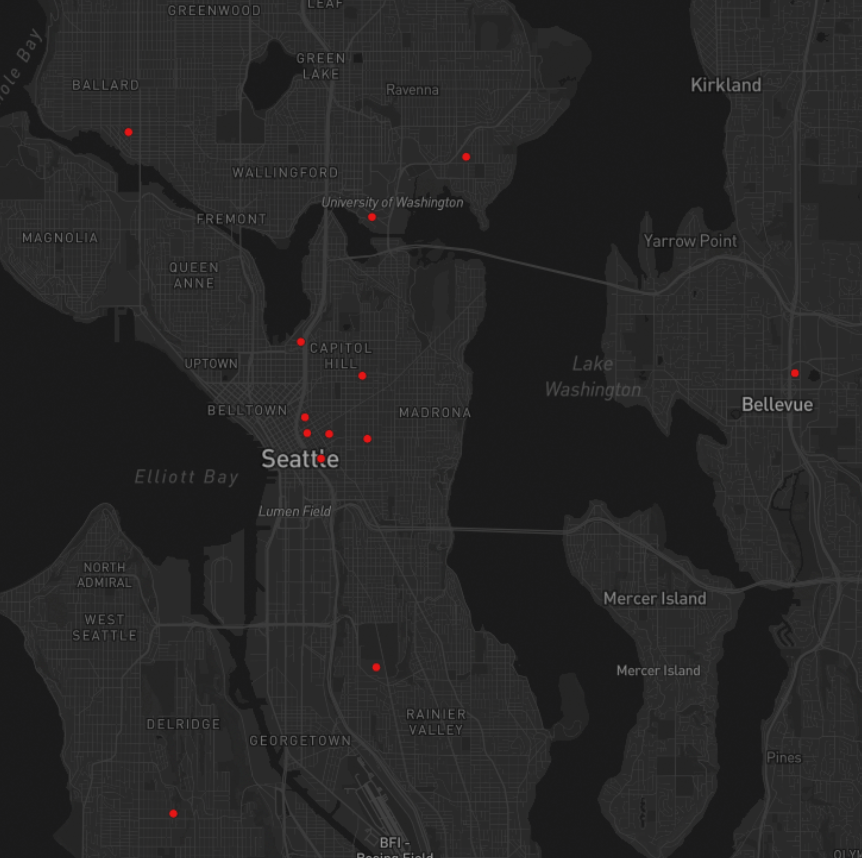
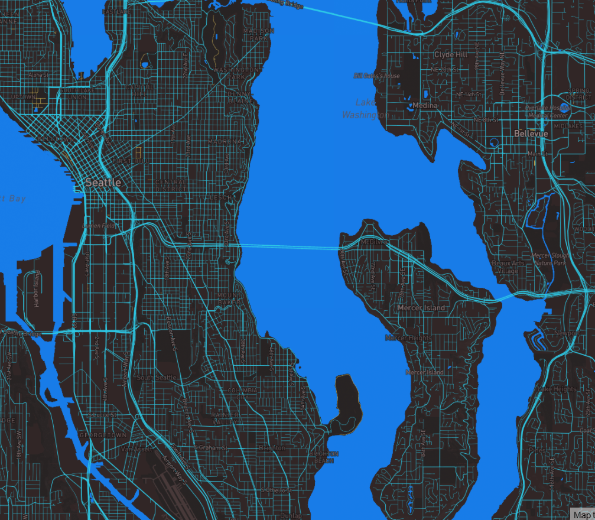

# Map Design and Tiles Generation

#### You can access the web map [here](http://127.0.0.1:5500/index.html).

## Screenshots of Layers

*Layer 1: This image consists of a map of Seattle using a Mapbox basemap. *

*Layer 2:This image consists of a map of hospitals within the Seattle area on a monochrome map. *

*Layer 3: This image consists of a map of hospitals within the Seattle area on the same Mapbox basemap from layer 1.*

*Layer 4: This image consists of a thematic map of Seattle. *

